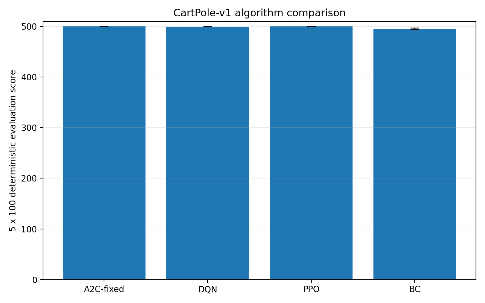
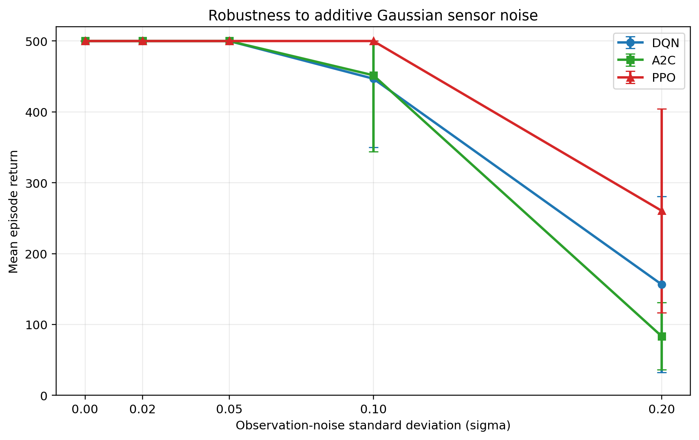
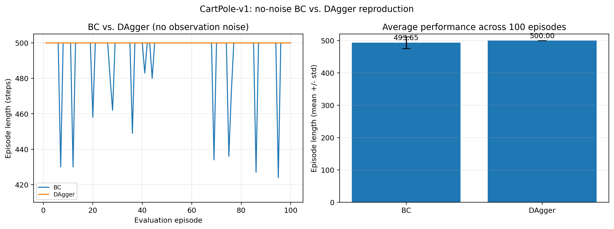

# Energy-Aware Multi-Agent Reinforcement Learning on CartPole-v1

**Three-member team project | Python, PyTorch, Gymnasium, NumPy, Matplotlib**

[Back to portfolio](../)

[Browse source code](https://github.com/0zz0ruby/cartpole-energy-aware-marl) ·
[Read the full report](https://github.com/0zz0ruby/cartpole-energy-aware-marl/blob/main/report/FinalReport.pdf)

## Project overview

This project compares DQN, A2C, PPO, and Behavior Cloning on Gymnasium's
CartPole-v1 using deterministic action selection and five repeated 100-episode
evaluations. The study examines final performance, training variability,
sample efficiency, and robustness to Gaussian observation noise.

## My contribution

- Optimized A2C and PPO hyperparameters through sensitivity analysis and grid
  search over learning rate, entropy coefficient, and clipping range.
- Designed `ForceSplitCartPole`, which decomposes the original binary action
  into direction selection and 11-level force-magnitude control.
- Implemented an energy-aware cooperative two-agent PPO controller and studied
  the trade-off between episode stability and average actuation force.

## Energy-aware Force-Split control

The direction agent chooses left or right, while the magnitude agent chooses
one of 11 normalized force levels. Both policies observe the same state and
receive the same cooperative reward:

```text
r = 1 - 0.1 * m^2
```

where `m` is the normalized force magnitude. This structure encourages the
agents to maintain balance while avoiding unnecessarily large control actions.
Training approached the 500-step episode cap as the average force ratio
decreased.

## Main project results

| Method | Final score |
| --- | ---: |
| DQN | 499.78 +/- 0.44 |
| A2C | 500.00 +/- 0.00 |
| PPO | 500.00 +/- 0.00 |
| Behavior Cloning | 495.68 +/- 1.40 |



Because clean-environment scores saturate at 500, robustness experiments offer
a more informative comparison. Under heavy Gaussian observation noise
(`sigma=0.20`), PPO achieved 260.56 mean steps, compared with 156.56 for DQN
and 83.56 for A2C.



The imitation-learning extension also compared offline BC with DAgger. Under
the same 100 deterministic evaluation seeds, DAgger reached `500.00 +/- 0.00`,
while BC achieved `493.65 +/- 18.17`.



## What I learned

This project showed that a saturated benchmark score can conceal meaningful
differences in training stability and robustness. It also demonstrated how
action decomposition and reward shaping can turn a simple control benchmark
into an interpretable cooperative-learning problem with an explicit
stability-energy trade-off.

## Scope and limitations

- The Force-Split implementation uses independent PPO policies with a shared
  reward, not a centralized critic.
- Reduced average force is an energy-aware proxy rather than a calibrated
  physical energy-saving percentage.
- The project-level DQN, A2C, PPO, BC, DAgger, and robustness results are team
  outcomes; my individual responsibilities are listed separately above.

