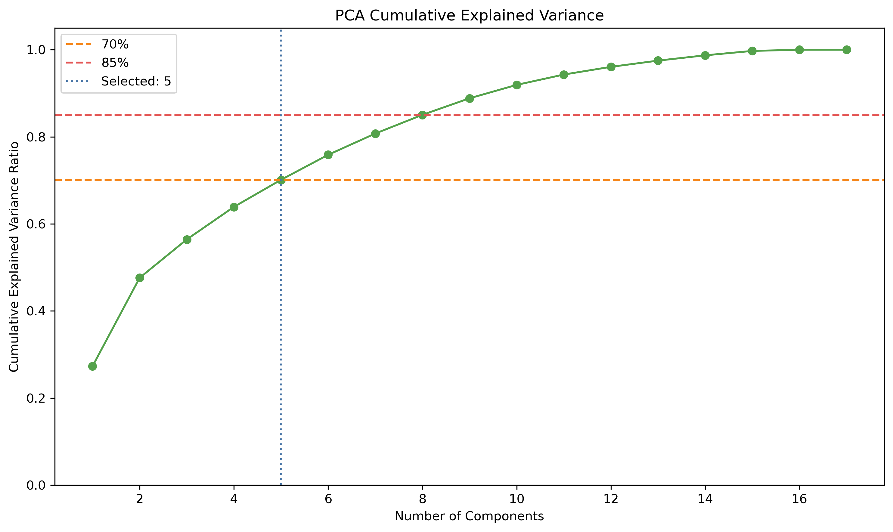
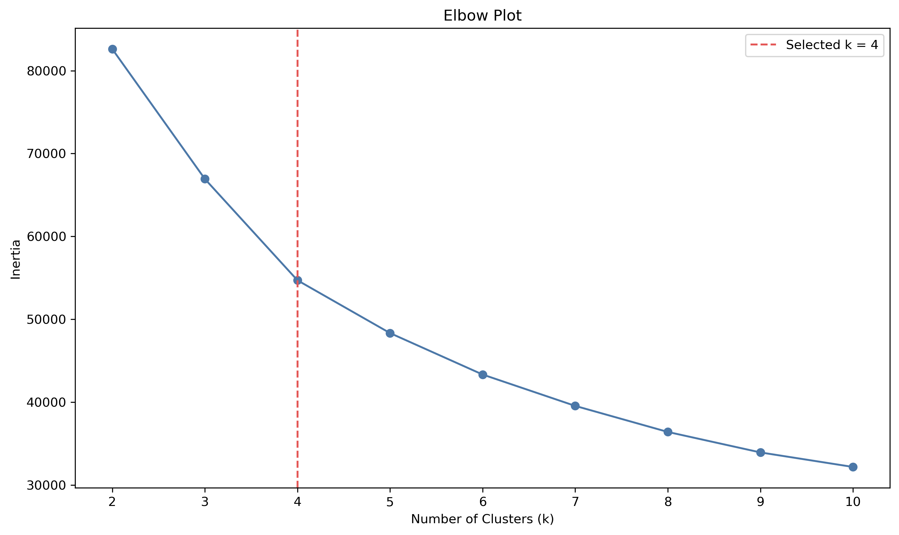
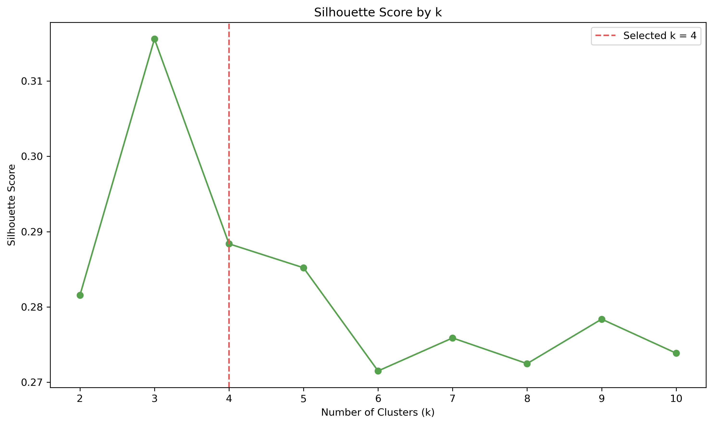
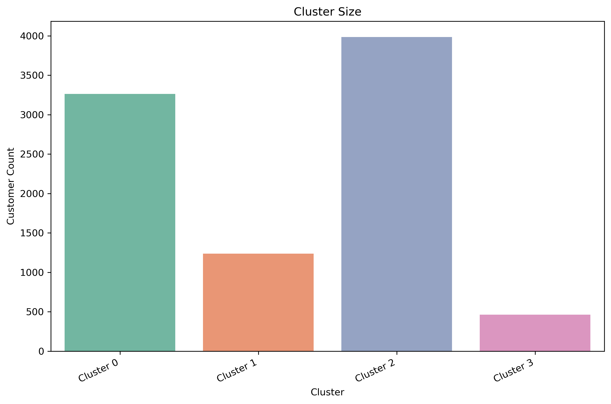
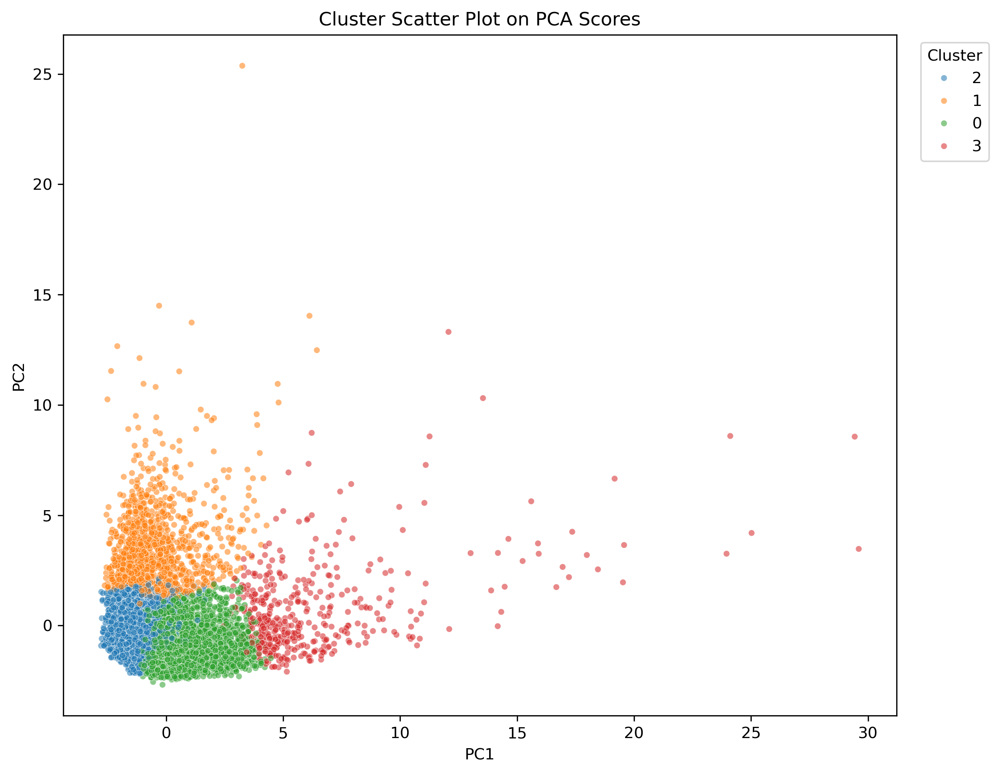
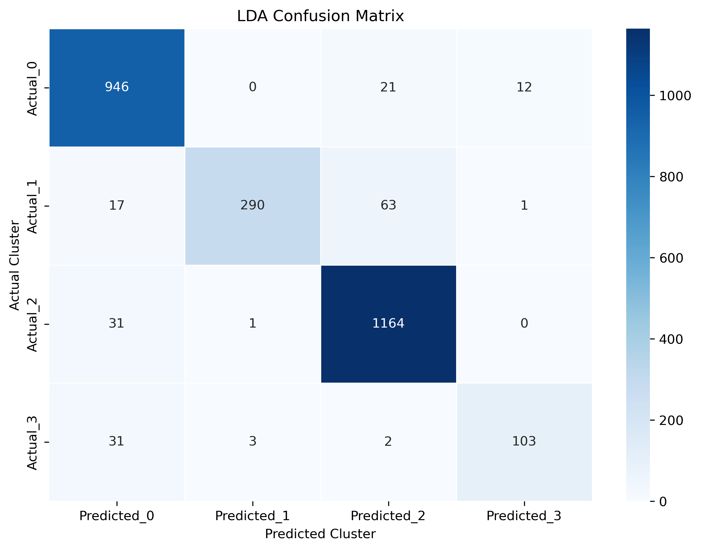
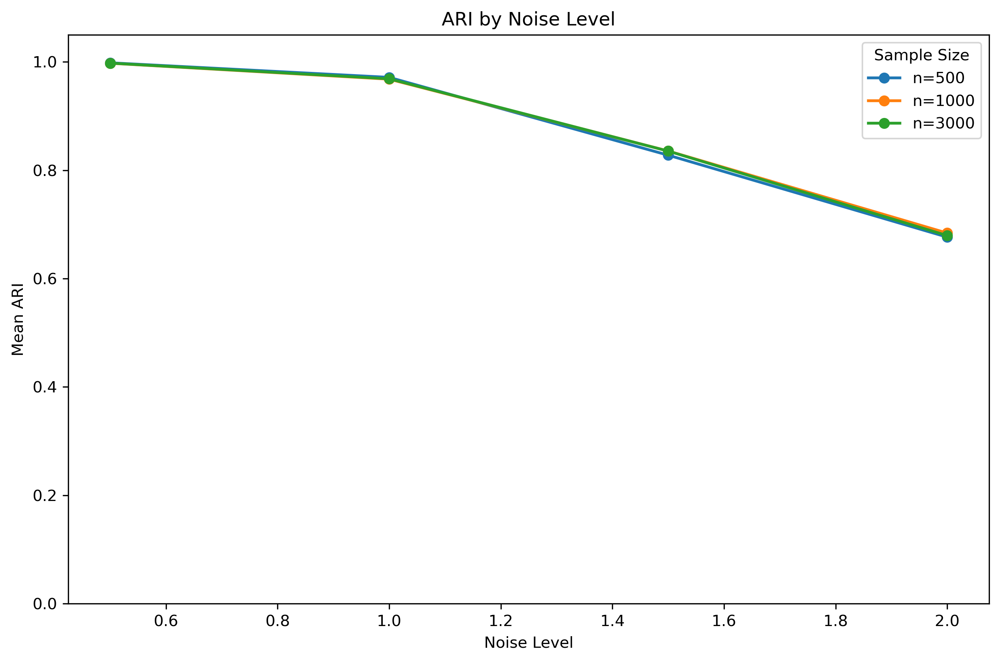
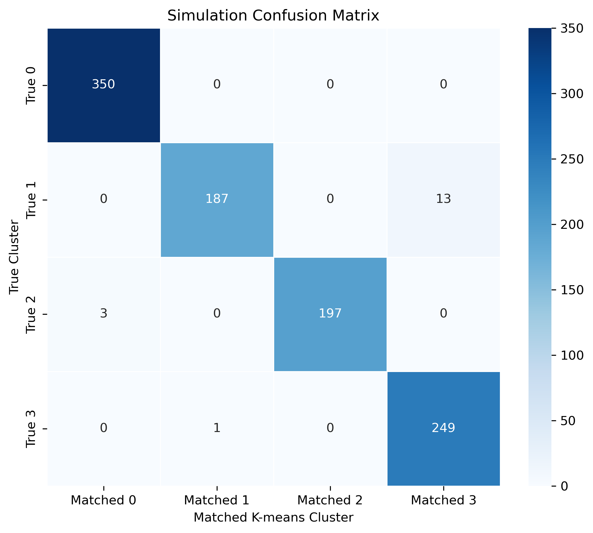

# Credit Card Customer Segmentation and Marketing Strategy Analysis

**Personal project | Python, Pandas, NumPy, Scikit-learn, SciPy, Matplotlib, Seaborn**

[Back to portfolio](../)

[Browse source code and result tables](https://github.com/0zz0ruby/credit-card-customer-segmentation)

## Project overview

Credit card customers differ substantially in spending intensity, cash-advance
usage, repayment behavior, and credit-limit utilization. This project develops
a reproducible customer-segmentation workflow that identifies distinct
behavioral groups and translates the results into actionable marketing and
risk-management strategies.

## Dataset

- **Source:** [Kaggle - Credit Card Dataset for Clustering](https://www.kaggle.com/datasets/arjunbhasin2013/ccdata)
- **Observations:** 8,950 customers
- **Modeling features:** 17 numerical behavioral variables
- **Coverage:** approximately six months of account activity

`CUST_ID` was excluded from modeling. Missing values in `CREDIT_LIMIT` and
`MINIMUM_PAYMENTS` were imputed using medians, and all modeling features were
standardized with Z-scores.

## Analytical workflow

1. Audited missing values, distributions, outliers, and correlations.
2. Standardized 17 behavioral variables to remove scale effects.
3. Applied PCA to reduce multicollinearity and create orthogonal clustering inputs.
4. Compared K-means solutions for `k = 2` through `k = 10`.
5. Profiled clusters on the original feature scale and developed business labels.
6. Assessed group differences and cluster separability.
7. Ran a Monte Carlo study under different sample sizes and noise levels.

## Dimensionality reduction

The first five principal components retained **70.13%** of total variance.
Their dominant behavioral dimensions captured:

- overall purchase activity;
- cash-advance dependency and balance pressure;
- purchase mode and installment preference;
- repayment structure and account maturity;
- installment repayment and one-off purchase frequency.

## Selecting the number of clusters

K-means solutions were evaluated using the elbow method, Silhouette Score,
Calinski-Harabasz Index, and Davies-Bouldin Index. The metrics did not all favor
the same value of `k`: the highest silhouette score occurred at `k = 3`, while
the Calinski-Harabasz Index was highest at `k = 4`. A four-cluster solution was
selected as a balance between internal metrics and business interpretability.

| Metric for the selected solution | Value |
| --- | ---: |
| Silhouette Score | 0.2884 |
| Calinski-Harabasz Index | 2,834.04 |
| Davies-Bouldin Index | 1.1785 |

## Customer segments

| Segment | Customers | Share | Main characteristics | Recommended action |
| --- | ---: | ---: | --- | --- |
| Stable spenders | 3,264 | 36.47% | Moderate spending, limited cash advances, relatively healthy repayment | Rewards, cashback, and loyalty campaigns |
| Cash-advance-dependent customers | 1,236 | 13.81% | High balances and cash advances, low full-payment rate | Repayment reminders, exposure monitoring, and dynamic limit management |
| Low-spending customers under repayment pressure | 3,986 | 44.54% | Low spending and payment levels, limited credit capacity | Low-cost activation without aggressive limit increases |
| High-value customers | 464 | 5.18% | Highest spending, credit limits, and payment amounts | Premium benefits and personalized retention programs |

## Validation

- Kruskal-Wallis tests found statistically significant differences across all
  four clusters for 10 key behavioral variables (`p < 0.05`).
- Linear Discriminant Analysis achieved **93.62% mean five-fold
  cross-validation accuracy**, indicating that the derived cluster labels are
  highly distinguishable in the original standardized feature space. This is a
  separability check, not accuracy against externally observed customer labels.

## Simulation study

The Monte Carlo experiment covered three sample sizes (`500`, `1,000`, and
`3,000`), four noise levels (`0.5`, `1.0`, `1.5`, and `2.0`), and 20 repetitions
per condition, for **240 runs** in total.

At the lowest noise level, mean ARI was approximately **0.998**, showing that
PCA and K-means recovered clearly separated synthetic customer groups. At the
highest noise level, mean ARI declined to approximately **0.680**, demonstrating
that cluster overlap and noise were more important limitations than sample size
within the tested range.

## Business implications

The segmentation supports differentiated customer management rather than a
single strategy for all cardholders. High-value customers can receive premium
retention offers, stable spenders can be encouraged through loyalty campaigns,
low-activity customers can receive controlled activation incentives, and
cash-advance-dependent customers can be prioritized for risk monitoring.

## Limitations

- The dataset contains no observed customer-segment labels or default outcomes.
- The analysis is cross-sectional and does not capture behavioral changes over time.
- K-means assumes distance-based, approximately spherical clusters and is
  sensitive to feature construction and the selected number of clusters.
- LDA evaluates the separability of derived labels rather than predictive
  performance against an independent ground truth.

## Reproducibility

The repository includes the complete analysis scripts, a dependency file,
selected result tables, and execution instructions. The original Kaggle dataset
is not duplicated; download instructions are included in the project folder.
